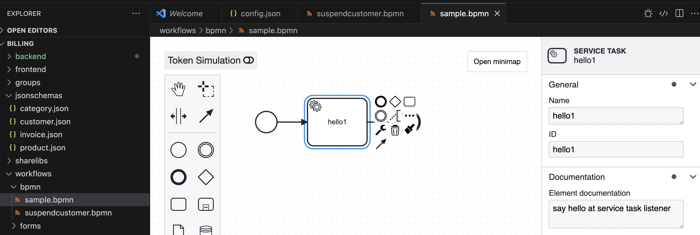

# BPMN Walk Through
BPMN allow us design complex computer readable business workflow diagram. Beside standard CRUD api, SimpleApp Generator allow flexible workflow by design `bpmn` document and optionally bind to specific `jsonschema` as easy access entry point.

At the moment, SimpleApp Generator using [bpmn-server](https://github.com/bpmnServer/bpmn-server) to process bpmn document, and map the business event to specific `document listener` in run time.

[bpmn-server](https://github.com/bpmnServer/bpmn-server) is young and may change frequently in future and cause some break of compatibility, but it look promising and allow very tight integration with our backend (nestjs). There is [BPMN Compatibility](#bpmn-compatibility) table


# Prepare your vscode ide
We recomend you to install vscode extension `Camunda Modeler` from `Miranium`.

# Using BPMN in SimpleApp Project
Use BPMN in SimpleApp Generator involve below steps:
1. Write definitions and generate codes
2. Modify generated source code


## Write definitions and generate codes
1. Ensure config.json declare bpmn folder,
```json
{ 
    ... # others props
    "bpmnFolder": "./workflows/bpmn", # empty will not generate workflow codes
    ... # others props
}

```
2. Create a sample business process definitions file: `project1/workflows/bpmn/suspendcustomer.bpmn`

3. (optional) Define alternate api entry point `additionalApis` at existing jsonschema to start the bpmn process. 
```json
# example customer.json
{
  "type": "object",
  "x-simpleapp-config": {
    "documentType": "cust",
    "documentName": "customer",
    "uniqueKey": "customerNo",
    "documentTitle": "customerName",
    "generateDocumentNumber": true,
    "isolationType": "org",
    "pageType": "crud",
    "additionalApis":[
      {
        "action":"suspend",
        "entryPoint":":id/suspend",
        "requiredRole":["Customer_update"],
        "method":"patch",
        "workflowSetting":{
          "bpmn":"suspendcustomer"
        },
        "description":"Suspend specific customer (set active=false)"
      }
    ]
  },
  "properties": {
    "_id": { "type": "string" },
    "created": { "type": "string" },
    "updated": { "type": "string" },
    "createdBy": { "type": "string" },
    "updatedBy": { "type": "string" },
    "tenantId": { "type": "integer", "default": 1 },
    "orgId": { "type": "integer", "default": 1 },
    "branchId": { "type": "integer", "default": 1 },
    "customerNo": {
      "type": "string",
      "format": "documentno",
      "examples": ["S0001"]
    },
    "customerName": {
      "type": "string",
      "examples": ["Customer 1"],
      "minLength": 3
    },
    "customerStatus": {
      "type": "string",
      "enum": ["unknown", "potential", "suspended", "existing"],
      "examples": ["unknown"]
    },
    "email": {
      "type": "string",
      "oneOf": [{ "format": "email" }, { "enum": [""] }]
    },
    "tel": {
      "type": "string",
      "oneOf": [{ "format": "tel" }, { "enum": [""] }]
    },
    "active": { "type": "boolean", "default": true, "examples": [true] },
    "description": { "type": "string", "format": "text" },
    "docNoFormat": {
      "type": "object",
      "x-foreignkey": "docnoformat",
      "properties": {
        "_id": { "type": "string" },
        "label": { "type": "string" }
      }
    }
  }
}

```
4. Generate (or regenerate) backend codes:
```bash
sh build.sh updatebackend
# observe generated code at below path:
# backend/src/simpleapp/services/cust.service.ts
# backend/src/simpleapp/workflows/bpmn/suspendcustomer.bpmn.ts
# backend/src/simpleapp/workflows/listeners/suspendcustomer.listener.ts
```
5. restart backend service
6. regenerate frontend codes (ensure backend regenerated and service restart):
```sh
sh build.sh updatefrontend
```
7. restart frontend service


## Modify generated source code
After source code generated, it add files into frontend and backend:
### Generated backend workflow files
1. `./src/simpleapp/workflows/bpmn/suspendcustomer.bpmn`: backend will use the bpmn to spawn workflow process
2. `./src/simpleapp/workflows/listeners/suspendcustomer.listener.ts`: this file will provide sample code of listen common `usertask` and `servicetask`. 
3. `./src/simpleapp/services/cust.service.ts`: If `customer.json` added additionalApis, after regenerate backend `customer.service.ts` auto created new rest api `runSuspend`, which will route the execution to generate new workflow process `suspendcustomer`.

### Generated frontend workflow files
1. `./simpleapp/workflows/bpmn/suspendcustomer.bpmn`: keep here for reference, frontend can render bpmn ui with this file
2. `./simpleapp/generate/clients/CustomerClient.ts`: added api entry point `runSuspend`.


### Understand Listener Codes
`./src/simpleapp/workflows/listeners/suspendcustomer.listener.ts` provide sample listener code of below task:

#### User Task
Sample code listen on user task `wait` & `invoke` event. you can add more (support `start,wait,invoke,end,assign`)    
1. `start`: task begin, seldom use
2. `wait`:  workflow suspend and waiting user input. You may send notification to users base on `props:UserTaskData`. To trigger workflow continue we shall call api `workflow/invoke-task/:taskId`
3. `invoked`: during user invoked process, you will obtain input data from actor. The workflow will go to `end` then move to next task
4. `end`: when current task completed, before move to next process (seldom use)
5. `assign`: during trigger when current task properties like assignee, candidateUsers, duedata changed. workflow status remain unchange.
#### Service Task
Sample code listen on `start` only, it support `start` and `end`. Event characteristic for `start` & `end` same with User task

### Modify Listener Codes

1. Remove `* --remove-this-line-to-prevent-override--` from top comment in `./src/simpleapp/workflows/listeners/suspendcustomer.listener.ts`
2. Put in suspend customer source code by modify the file.
```ts
//plenty of import here
@Injectable()
export class SuspendcustomerListenerService extends SimpleAppListenerService {
  logger = new Logger();
  constructor() {
    super();
  }
  @OnEvent('suspendcustomer.hello1.start')
  async watch_hello1_start(props: ServiceTaskData) {
    console.log('Running listener  suspendcustomer.hello1.start', props);
  }
}
```
to
```ts
//plenty of import here
import { CustomerService } from 'src/simpleapp/services/cust.service'; //import customer service class
@Injectable()
export class SuspendcustomerListenerService extends SimpleAppListenerService {
  logger = new Logger();
  constructor(private custService:CustomerService) {  //inject custService object
    super();
  }

  @OnEvent('suspendcustomer.hello1.start')
  async watch_hello1_start(props: ServiceTaskData) {
    const appuser = this.prepareAppUser(props.data)  //obtain user info, and perform data isolation
    const id = props.data._id
    //find existing record and suspend it
    const newdata = await  this.custService.findById(appuser,id) 
    newdata.active=false
    await this.custService.findIdThenUpdate(appuser,props.data._id,newdata)  //save into database
  }
}
```

# BPMN Compatibility
| type |status|description|
|------|------|-----------|
